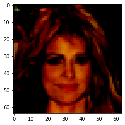
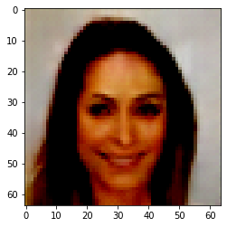
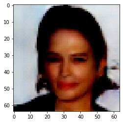

# This Person Doesnt Exist - DCGAN


### About DCGAN
A DCGAN is a direct extension of the GAN described above, except that it explicitly uses convolutional and convolutional-transpose layers in the discriminator and generator, respectively.<br/>
In the paper Unsupervised <a href="https://arxiv.org/pdf/1511.06434.pdf">Representation Learning With Deep Convolutional Generative Adversarial Networks</a>. The discriminator is made up of strided convolution layers, batch norm layers, and LeakyReLU activations. The input is a 3x64x64 input image and the output is a scalar probability that the input is from the real data distribution. The generator is comprised of convolutional-transpose layers, batch norm layers, and ReLU activations. The input is a latent vector, z, that is drawn from a standard normal distribution and the output is a 3x64x64 RGB image. The strided conv-transpose layers allow the latent vector to be transformed into a volume with the same shape as an image. In the paper, the authors also give some tips about how to setup the optimizers, how to calculate the loss functions, and how to initialize the model weights, all of which will be explained in the coming sections. <br/>


#### Dataset 
In this the dataset used is <a href="http://mmlab.ie.cuhk.edu.hk/projects/CelebA.html">Celeb-A Faces</a> dataset. <br/>
This dataset has more than 200k photo from people(celebrities) around the world.

### Model Implementation

#### Generator Network

The generator, G, is designed to map the latent space vector (z) to data-space. Since our data are images, converting z to data-space means ultimately creating a RGB image with the same size as the training images (i.e. 3x64x64). In practice, this is accomplished through a series of strided two dimensional convolutional transpose layers, each paired with a 2d batch norm layer and a relu activation. The output of the generator is fed through a tanh function to return it to the input data range of [−1,1]. It is worth noting the existence of the batch norm functions after the conv-transpose layers, as this is a critical contribution of the DCGAN paper. These layers help with the flow of gradients during training. An image of the generator from the DCGAN paper is shown below.


#### Discriminator

As mentioned, the discriminator, $\mathbb D$, is a binary classification network that takes an image as input and outputs a scalar probability that the input image is real (as opposed to fake). Here, $\mathbb D$ takes a 3x64x64 input image, processes it through a series of Conv2d, BatchNorm2d, and LeakyReLU layers, and outputs the final probability through a Sigmoid activation function. This architecture can be extended with more layers if necessary for the problem, but there is significance to the use of the strided convolution, BatchNorm, and LeakyReLUs. The DCGAN paper mentions it is a good practice to use strided convolution rather than pooling to downsample because it lets the network learn its own pooling function. Also batch norm and leaky relu functions promote healthy gradient flow which is critical for the learning process of both G and D.

#### Training

##### **Train the Discriminator**
The goal of training the discriminator is to maximize the probability of correctly classifying a given input as real or fake.
Due to the separate mini-batch suggestion from ganhacks, we will calculate this in two steps. First, we will construct a batch of real samples from the training set, forward pass through D, calculate the loss $\log(D(x))$, then calculate the gradients in a backward pass. Secondly, we will construct a batch of fake samples with the current generator, forward pass this batch through D, calculate the loss $\log(1−D(G(z)))$, and accumulate the gradients with a backward pass. Now, with the gradients accumulated from both the all-real and all-fake batches, we call a step of the Discriminator’s optimizer.


##### **Train the Generator**

As stated in the original paper, we want to train the Generator by minimizing $\log(1−D(G(z)))$ in an effort to generate better fakes. As mentioned, this was shown by Goodfellow to not provide sufficient gradients, especially early in the learning process. As a fix, we instead wish to maximize $\log(D(G(z)))$. In the code we accomplish this by: classifying the Generator output from Part 1 with the Discriminator, computing G’s loss using real labels as GT, computing G’s gradients in a backward pass, and finally updating G’s parameters with an optimizer step.


Here are more examples.


```

```

    Clipping input data to the valid range for imshow with RGB data ([0..1] for floats or [0..255] for integers).





```

```

    Clipping input data to the valid range for imshow with RGB data ([0..1] for floats or [0..255] for integers).





```

```

    Clipping input data to the valid range for imshow with RGB data ([0..1] for floats or [0..255] for integers).




